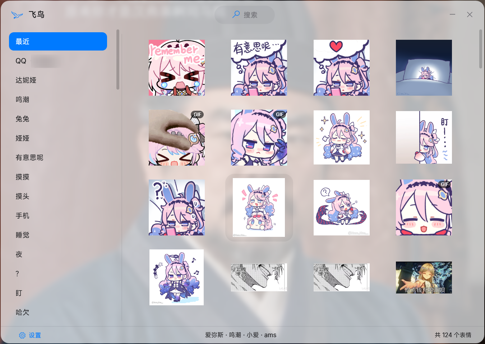
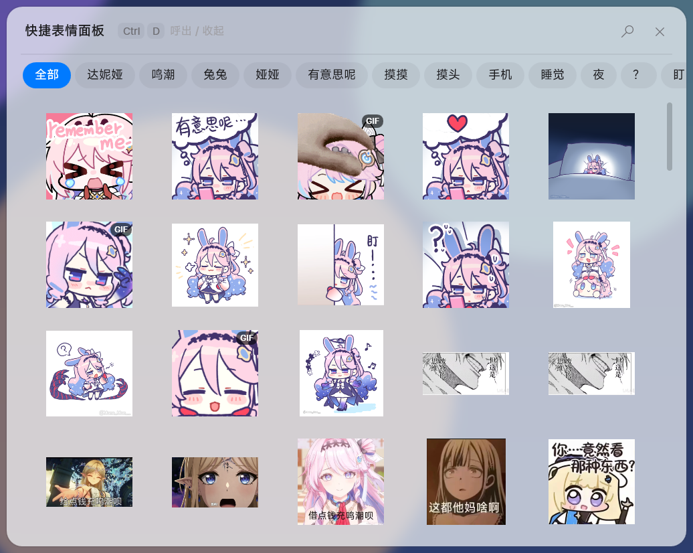
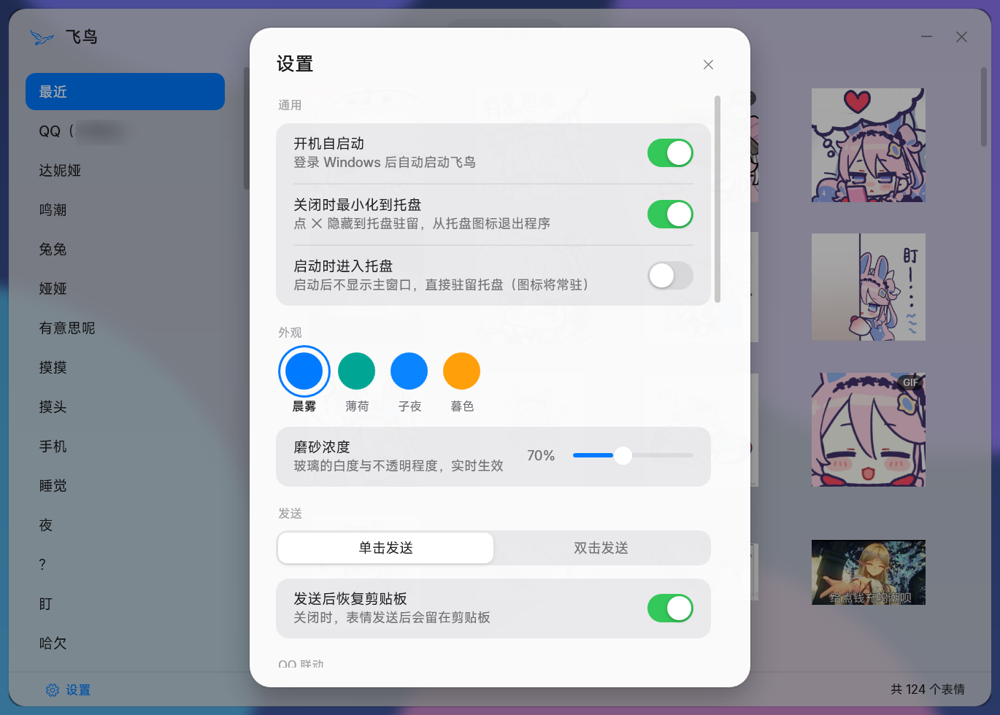

<div align="center">


# Asuka (飞鸟)

**Sticker manager for Windows — built for PC QQ, works everywhere images can be pasted**

English | [简体中文](README.md)

`WPF` `.NET 10` `Windows 10/11` `v1.0.0`

</div>

---

Asuka gathers the stickers scattered across your QQ favorites, chat history and browser
into one local library: tag them, rank them by how often (and how recently) you use them,
preview GIFs on hover — then **send any of them into any app with one click**.
Sending goes through the system clipboard plus a simulated paste: no injection, no ban risk,
original quality and animation fully preserved.

It integrates deeply with PC QQ (NTQQ): when you open QQ's built-in sticker panel, Asuka
automatically pops up its quick panel right next to it — side by side, and both close
together when you're done, just like a native feature. Any app that accepts pasted images
(WeChat, TIM, browsers, Office…) works with the global-hotkey quick panel.

<div align="center">

</div>

## 🚀 Quick Start

1. **Download & run**: grab `Asuka.zip` from [Releases](../../releases), unzip and run `Asuka.exe` (needs the [.NET 10 Desktop Runtime](https://dotnet.microsoft.com/download/dotnet/10.0), x64 — see Installation below)
2. **Import stickers**: drag image files or whole folders onto the window, then batch-tag them
3. **Send**: press `Ctrl+Alt+D` in any chat input to summon the quick panel, then click a sticker to paste it
4. **Go further**: bind your QQ account under Settings → QQ integration to mirror your favorites; "copy image" in any app to import it with one click

Step 3 is already the whole loop — everything below is detail.

## 📦 Installation

### Download (recommended)

Grab the latest `Asuka.zip` from [Releases](../../releases), unzip and run `Asuka.exe`.

> Single-file build; requires the [.NET 10 Desktop Runtime](https://dotnet.microsoft.com/download/dotnet/10.0) (x64).

### Build from source

```bash
git clone https://github.com/lorinatsureborn/OICQStickerManager.git
cd OICQStickerManager
dotnet build -c Release
# output in bin/Release/net10.0-windows/
```

Requires Windows 10/11 and the .NET 10 SDK (desktop workload included). To publish a single file:

```bash
dotnet publish -c Release -r win-x64 --self-contained false -p:PublishSingleFile=true -o publish
```

## ✨ Key Features

### Library
- **Drag & drop import**: drop files or whole folders onto the window, then batch-tag them in the editor
- **Smart importing**: content MD5 de-duplication, magic-number sniffing to fix wrong extensions, automatic WebP → PNG conversion
- **Tag system**: multiple tags per sticker, tag pool picking, filter by tag; hovering a sticker shows its tags
- **Frecency ranking**: frequency × recency scoring keeps your favorites on top; a "Recent" view is always there
- **GIF hover preview**: static grid with badges; hover 400 ms for an animated bubble — smooth scrolling, flat memory

### Fast sending
- **Quick panel**: summon it anywhere with a global hotkey (default `Ctrl+Alt+D`); it's a non-activating window that never steals your chat focus
- **One click, delivered**: click a sticker → it's pasted into the current chat input, panel closes itself
- **Capsule tabs**: hover to switch tags inside the panel (150 ms intent delay), resets to "All" every time it opens
- **Single / double click**, with system-level double-click debouncing so a fast double-tap never sends twice
- **Clipboard courtesy**: your previous clipboard content is restored after sending — or turn that off to keep the sticker on the clipboard for repeated pasting

### QQ integration (zero injection)
- **Panel co-existence**: click the sticker button in a QQ chat window and Asuka's quick panel appears next to QQ's native one; close QQ's panel and Asuka's follows; sending closes both
- **Favorites mirror**: bind a QQ account and a "QQ (alias)" tab appears in the library — a live mirror of your QQ favorites page, synced in near real time; send directly (zero-copy) or right-click to adopt stickers into the library
- **Multi-account**: bind several QQ numbers at once; Asuka only asks, never binds on its own
- **"Add to stickers" hook**: right-click an image in QQ → "Add to stickers", and Asuka imports it according to your settings
- **Clipboard capture**: "Copy image" in QQ, WeChat or a browser → a toast pops up for one-click import; duplicates stay silent
- **Deep sync (optional)**: detect stickers you've un-favorited in QQ but whose cache files remain, and handle them by policy (mark only / delete / adopt into library)

### UI & desktop experience
- **iOS 26 liquid glass**: real backdrop blur, four palettes (aurora / mint / midnight / ember) switched at runtime, adjustable frost intensity
- **Tray resident**: close-to-tray (asks once and remembers), launch on startup, silent tray start, single instance
- **No silent data loss**: atomic writes + backup + self-healing recovery for all persisted data, with a visible alert if anything ever fails

## 📖 Usage

### 1. Import stickers

| Method | How |
|---|---|
| Drag & drop | Drag image files / folders onto the main window, then batch-tag them |
| Clipboard capture | "Copy image" in any app → toast at the bottom-right → click to import |
| QQ favorites hook | Right-click an image in QQ → "Add to stickers" |

Importing automatically handles de-duplication (MD5), format correction (by file header, not extension) and WebP → PNG conversion.

### 2. Organize & find

- Filter with the tag list on the left, or search tags globally; click a tag capsule while searching to switch search terms quickly
- The default "Recent" view is frecency-ranked: more frequent and more recent use floats to the top
- Hover any sticker to preview animations and see its tags; right-click to edit tags, delete, or open the containing folder

### 3. Send stickers

<div align="center">

</div>

**Quick panel (recommended)**: press `Ctrl+Alt+D` in a chat input → the panel pops up next to your cursor → click a sticker → it's pasted and the panel closes. Focus never leaves the chat window.
Hover the capsule tabs to switch tags; the 🔍 button jumps to the main window's search.

**Main window**: single-click (or double-click, configurable) a sticker → the window minimizes itself and pastes into the previously active window.

**QQ co-existence mode**: click the sticker button in a QQ chat → as QQ's native panel opens, Asuka's panel appears beside it → click a sticker in Asuka to paste it into the input; both panels close together. No hotkey needed.

> How sending works: the image is written to the clipboard as a file drop list and a `Ctrl+V` is simulated — the only channel that preserves animated GIFs and original quality with zero injection into the target app. Your previous clipboard content is restored within a second.

## ⚙️ Settings

<div align="center">

</div>

Open Settings from the bottom-left of the main window.

**General**
| Setting | Description |
|---|---|
| Launch on startup | Start Asuka automatically when you log in to Windows |
| Close to tray | ✕ hides to the tray; quit from the tray icon. You're asked once the first time and the choice is remembered |
| Start minimized to tray | Launch without showing the main window, resident in the tray (pairs well with startup) |

**Appearance**
| Setting | Description |
|---|---|
| Theme | Four palettes — aurora / mint / midnight / ember — switched live |
| Frost intensity | Whiteness and opacity of the glass material (50–100%), previewed live |

**Sending**
| Setting | Description |
|---|---|
| Single / double click | Click behavior in the library; double-click mode debounces repeats within the system double-click interval |
| Restore clipboard after send | On by default: your previous clipboard is restored after sending; off, the sticker stays on the clipboard for repeated pasting |

**Hotkeys**
| Setting | Description |
|---|---|
| Toggle quick panel | Default `Ctrl+Alt+D`. Click the capture box and press a new combination to change it (Esc cancels); a reset-to-default button is provided |

**QQ integration**
| Setting | Description |
|---|---|
| Bind QQ stickers… | Scans local QQ accounts for multi-select binding / unbinding; each binding gets its own "QQ (alias)" tab |
| QQ sticker panel co-existence | Opens the quick panel beside QQ's native sticker panel automatically |
| Polling fallback | Recommended if the quick panel ever fails to appear/close; periodically polls QQ's sticker panel state to keep the linkage working — negligible performance cost |
| Auto-import new QQ favorites | Right-click → "Add to stickers" in QQ is copied into the library with a "QQ" tag automatically; off = no auto import |
| QQ deep sync | Recommended if you want un-favorited stickers detected automatically; walks you through a one-time official tool to read the favorites index (one login, key kept locally). Choose what happens to un-favorited stickers: mark / delete / adopt into library |

**Library / Storage**
| Setting | Description |
|---|---|
| GIF hover preview | Plays animated bubbles when hovering stickers |
| Prompt to import copied images | "Copy image" in QQ, browsers or any app → one-click import toast at the bottom-right |
| Toast duration | How long the import toast stays on screen (3–15 s, default 8); an unanswered toast counts as ignored and dismisses itself |
| WebP image support | Shows system WebP decoding status; links to the Microsoft Store "WebP Image Extension" when missing, with a re-check button |
| Open sticker folder | Opens the local library directory |

**Data location**: everything lives in `Documents\OICQStickerManager\` (`Library` images +
`stickers.json` tags + `config.json` settings) — back up or migrate by copying the folder.

## 🔒 Privacy & Safety

- Stickers and settings **never leave your machine**; core features do **no networking** and **no injection** — nothing about QQ is modified;
- QQ integration is built on read-only file-system watching and Windows UI Automation (read-only sensing), coexisting with QQ's official features;
- Deep sync (off by default) is the one exception: when enabled it downloads the third-party open-source script
  [QQBackup/qq-win-db-key](https://github.com/QQBackup/qq-win-db-key) from GitHub to read the favorites index once; the key stays on your machine. The whole process is read-only — no injection, no writes to QQ — and any failure degrades gracefully.

## ⚠️ Known Limitations

- Windows 10/11 (x64) only;
- Animated WebP can't be imported (converted to static PNG); GIF is fully supported;
- The quick panel is a non-activating window (it never steals chat focus), so it has no search box — the 🔍 button jumps to the main window's search instead;
- Apps without UI-automation integration (e.g. WeChat): use the global hotkey for the quick panel;
- Major QQ updates may break the co-existence linkage — a benign degradation; enabling "Polling fallback" restores it.

## 📄 License

This project is licensed under the [MIT](LICENSE) license. Embedded fonts ship under their own licenses: [Inter](https://rsms.me/inter/) (SIL OFL 1.1), [MiSans](https://hyperos.mi.com/font) (free commercial license by Xiaomi); license files in [Fonts/](Fonts/).

## 🙏 Acknowledgements

- [QQBackup/qq-win-db-key](https://github.com/QQBackup/qq-win-db-key) — QQ favorites index key extraction (deep sync, optional)
- [VirtualizingWrapPanel](https://github.com/sbaeumlisberger/VirtualizingWrapPanel), [WpfAnimatedGif](https://github.com/XamlAnimatedGif/WpfAnimatedGif)
- Fonts: [Inter](https://rsms.me/inter/) (SIL OFL 1.1), [MiSans](https://hyperos.mi.com/font) (free commercial license by Xiaomi); license files in [Fonts/](Fonts/)

## 📄 Docs

- [Design notes: QQ integration & import pipeline](docs/ADD-TO-GALLERY-AND-QQ-SYNC-DESIGN.md) (Chinese) — technical choices and forensic notes behind the QQ integration
